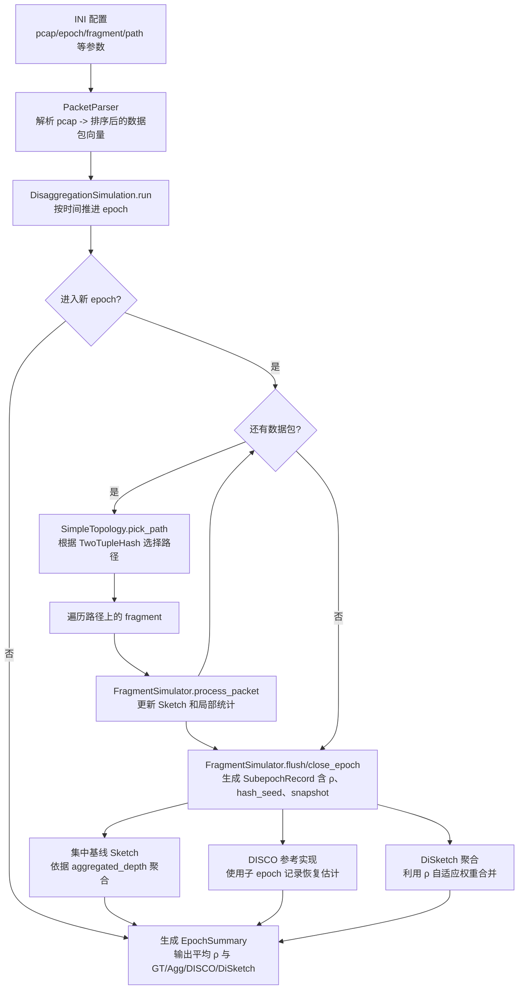

# DiSketch

## 项目简介

DiSketch 是一个基于 Sketch 算法的分布式部署并聚合统计的网络测量框架。

## 项目结构

```
DiSketch/
├── CMakeLists.txt        # 顶层 CMake 工程配置
├── examples/             # 示例程序
│   ├── parse_pcap.cpp
│   └── disketch_simulation.cpp
├── include/
│   ├── PacketParser.h
│   └── disketch/         # 时空分片仿真相关头文件
│       ├── SimulationTypes.h
│       ├── FragmentSimulator.h
│       ├── SimpleTopology.h
│       └── DisaggregationSimulation.h
├── src/
│   ├── PacketParser.cpp
│   └── disketch/         # 仿真核心实现
│       ├── FragmentSimulator.cpp
│       ├── SimpleTopology.cpp
│       └── DisaggregationSimulation.cpp
├── PcapPlusPlus-25.05/   # PcapPlusPlus 库（用于解析 pcap 文件）
├── SketchLib/            # Sketch 算法库（Git Submodule）
├── docs/
├── configs/
├── datasets/
├── scripts/
└── README.md

```

## 时空分片仿真示例

新增的 `disketch_simulation` 示例整合了论文中的时空分片、误差均衡与集中查询流程，可直接在现有数据与 Sketch 实现的基础上进行仿真评估。

### 核心类职责与接口

下面按文件介绍各类和结构体的字段、函数以及它们在 DiSketch 仿真中的作用。无需阅读原论文即可理解核心逻辑。

#### `disketch/SimulationTypes.h`

- **`SketchKind`**：列举当前支持的 Sketch 类型（CountMin、CountSketch、UnivMon），用作统一的枚举选择。
- **`FragmentSetting`**：描述单个分片的硬件/参数设定。
	- `name`：片段在拓扑中的名称，用于调试与输出。
	- `kind`：Sketch 算法类型。
	- `memory_bytes`：分配的 Sketch 内存大小（影响宽度/桶数）。
	- `depth`：对于 CountMin/CountSketch 表示行数，对于 UnivMon 表示层数。
	- `initial_subepoch`/`max_subepoch`：决定子 epoch 的起始值与上限，用于自适应扩展。
	- `rho_target`：期望的噪声上界，FragmentSimulator 会根据它判断是否需要增加子 epoch。
	- `boost_single_hop`：单跳流是否需要提升采样权重，弥补路径过短造成的偏差。
	- `background_ratio`：背景噪声比例，帮助在计算 ρ 时估计未显式观测到的背景流量。
- **`PathSetting`**：给出一条路径的名称及其包含的 fragment 下标，对应拓扑中可能的行进路线。
- **`SubepochRecord`**：FragmentSimulator 在每个子 epoch 结束时输出的记录。
	- 包含 `fragment_index`、`epoch_id`、`subepoch_id` 等标识，以及 `hash_seed`、`packet_count`、`rho_estimate` 等统计信息。
	- `snapshot` 为该子 epoch 的 Sketch 快照，供聚合阶段还原估计。
- **`FragmentEpochReport`**：收集某个 fragment 在单个 epoch 内的所有子 epoch 记录，并记录平均 ρ。
- **`TopologyConfig`**：组合 `fragments` 与 `paths`，描述实验采用的逻辑拓扑结构。
- **`FlowMetric`**：单条重点流在不同方案（GT/Agg/DISCO/DiSketch）下的对比结果。
- **`EpochSummary`**：整合一个 epoch 的平均 ρ 以及重点流指标，用于最终报告。
- **`SimulationConfig`**：给出全局的运行参数，例如 pcap 文件路径、epoch 时长、聚合端 Sketch 深度、重点流筛选阈值以及拓扑配置。
- **`SimulationReport`**：所有 epoch 的汇总结果，是仿真主流程的输出。

#### `disketch/FragmentSimulator.h`

- 核心职责：模拟单个 fragment 在一个 epoch 中的行为，包括子 epoch 划分、Sketch 更新、ρ 估计与自适应控制。
- 主要函数：
	- `FragmentSimulator(...)`：构造函数，接收 fragment 设置与 epoch 时长。
	- `begin_epoch(epoch_id, start_ns)`：在每个 epoch 开始时重置内部状态。
	- `process_packet(flow, time_ns, single_hop)`：处理一条数据包，根据是否单跳和当前子 epoch 状态决定是否采样。
	- `close_epoch()`：结束当前 epoch，输出 `FragmentEpochReport` 并准备进入下一轮。
- 关键字段：
	- `setting_`、`epoch_duration_ns_`：当前 fragment 的基本配置。
	- `subepoch_count_`、`current_subepoch_`：追踪子 epoch 的数量与处理进度。
	- `context_`：通过 `flow_counter` 与 `packet_counter` 累计当前子 epoch 的统计量。
	- `emitted_records_`：缓存所有已经完成的子 epoch 记录，供聚合模块消费。

#### `disketch/SimpleTopology.h`

- 核心职责：为输入流选择一个稳定的路径，使同一流在多次仿真中始终映射到相同的 fragment 序列。
- 主要函数：
	- `SimpleTopology(config)`：读入拓扑配置，保存 fragment 和路径列表。
	- `fragment(index)` / `paths()` / `path_count()`：提供只读访问，以便其他模块查询配置。
	- `pick_path(flow)`：基于 `TwoTupleHash` 生成的 seeded hash 选择路径。
- 关键字段：
	- `config_`：存储拓扑的全部定义。
	- `rng_`：为 seeded hash 提供种子来源，保证路径选择可复现。

#### `disketch/DisaggregationSimulation.h`

- 核心职责：串联解析的数据包、FragmentSimulator 与 SimpleTopology，执行完整的时空分片仿真流程，并输出 `SimulationReport`。
- 主要函数：
	- `DisaggregationSimulation(config)`：初始化全局配置。
	- `run(packets)`：依次扫描数据包，驱动所有 fragment 处理并聚合结果，最终返回每个 epoch 的统计。
	- `create_aggregated_sketch(memory_bytes)`：根据配置生成集中式基线的 Sketch。
	- `estimate_flow_from_records(flow, path, records, topo_cfg)`：从 fragment 的子 epoch 记录中恢复对单个流的估计值。
	- `record_contains_flow(record, flow, single_hop, boost_single_hop)`：判定记录是否需要参与目标流的估计。
- 关键字段：
	- `config_`：全局运行参数。
	- `topology_`：用于在仿真过程中快速查询 fragment 和路径信息。

### 数据包处理流程图

下图基于 `configs/disketch.ini` 的配置，展示了 DiSketch 仿真在一个 epoch 内如何处理数据包并形成最终指标：



- **INI 配置**：`pcap`、`epoch_ns`、`max_epochs` 控制时间维度；多个 `[fragment]` 段描述边缘/核心节点的内存与自适应策略；`[path]` 列表决定可选的转发路径。
- **PacketParser**：按时间戳顺序读取 `pcap` 中的数据包，提供 `(TwoTuple, timestamp)` 供仿真迭代。
- **SimpleTopology**：根据 `nodes=edge_a,core,edge_b` 等配置，建立路径表，并用哈希保证同一流在多个 epoch 中分配到一致路径。
- **FragmentSimulator**：沿路径对每个 fragment 更新对应的 Sketch；当子 epoch 结束，输出 `SubepochRecord`（包含 `hash_seed`、`packet_count`、`rho_estimate` 以及 Sketch 快照）。
- **聚合阶段**：
	- `aggregated_depth` 控制集中基线 Sketch 的维度。
	- DISCO 与 DiSketch 方案都遍历 fragment 输出：前者模拟传统 DISCO 重放流程，后者根据 `rho_target`、`boost_single_hop` 等参数调整权重。
- **EpochSummary**：收集 Ground Truth（Ideal 模型）、集中聚合、DISCO 与 DiSketch 的估计值，并计算每个 fragment 的平均 ρ。

### 快速体验

- 配置文件：`configs/disketch.ini`
- 默认数据集：`datasets/caida_600w.pcap`

执行示例如下：

```bash
cd build
./disketch_simulation ../configs/disketch.ini
```

程序会输出每个 epoch 的平均 `rho`、各方案（集中部署、DISCO、DiSketch）在重点流上的估计结果，便于快速检查误差差异。

### 配置文件格式说明

配置文件使用简易 INI 形式，支持以下关键字段：

- 全局段：`pcap`（数据路径）、`sketch_kind`、`epoch_ns`、`max_epochs`、`aggregated_depth`、`heavy_ratio`、`max_flow_report`。
- `[fragment]` 段：定义节点名称、Sketch 类型、内存、行数/层数、子 epoch 参数、误差目标、单跳补偿等。
- `[path]` 段：通过节点名称列出一条可能的转发表达路径，仿真时会按流哈希自动映射。

所有参数均可按需调整，便于后续扩展更多拓扑、内存分布或误差目标实验。程序会自动校验片段与路径是否一致，并给出必要的失败提示。

## 依赖与构建

### 系统要求

- CMake ≥ 3.16
- Ninja 构建系统
- 支持 C++14 的编译器

### 依赖说明

本项目**无需单独安装** PcapPlusPlus 或 SketchLib。所有依赖都作为子项目在顶层 CMake 中一同构建：

- **PcapPlusPlus-25.05**：已在项目目录下配置好，只编译 `Common++` 和 `Packet++` 模块，足够用于解析 pcap 文件。
- **SketchLib**：作为 Git Submodule 管理，CMake 会自动将其编译为静态库。

### 构建步骤

使用 CMake + Ninja 进行构建：

```bash
# 在项目根目录下创建 build 目录
mkdir build
cd build

# 配置 CMake，使用 Ninja 生成器
cmake -G Ninja ..

# 编译项目
ninja
```

示例程序会调用 `PacketParser`，将 pcap 文件转换为按时间戳升序排序的数据包向量。每个元素包含：
- 源 IP 地址（`src_ip`）
- 目的 IP 地址（`dst_ip`）
- 时间戳（`timestamp: std::chrono::nanoseconds`）

解析后的数据可直接用于后续的 Sketch 算法计算。

### 关于 SketchLib Submodule

**SketchLib** 是作为 Git Submodule 引入的外部依赖库，来源于 [HongminTan/SketchLib](https://github.com/HongminTan/SketchLib)。

## Git Submodule 操作指南

### 首次克隆项目（包含 submodule）

如果首次克隆本项目，需要同时初始化并更新 submodule：

```bash
# 方式 1：克隆时自动初始化 submodule
git clone --recursive git@github.com:HongminTan/DiSketch.git

# 方式 2：先克隆项目，再初始化 submodule
git clone git@github.com:HongminTan/DiSketch.git
cd DiSketch
git submodule init
git submodule update
```

### 更新 Submodule 到最新版本

当 SketchLib 仓库有更新时，可以使用以下命令更新 submodule：

```bash
# 进入 submodule 目录
cd SketchLib

# 拉取最新代码
git pull origin main

# 返回主项目目录
cd ..

# 提交 submodule 的更新
git add SketchLib
git commit -m "Update SketchLib Submodule"
git push
```

或者使用一条命令更新所有 submodule：

```bash
git submodule update --remote --merge
```

### 在当前项目中修改 Submodule 并推送

如果需要在 DiSketch 项目中修改 SketchLib 代码，并将修改推送到 SketchLib 仓库：

#### 步骤 1：在 Submodule 中进行修改

```bash
# 进入 submodule 目录
cd SketchLib

# 确保在正确的分支上
git checkout main

# 进行代码修改...
# 修改完成后，提交更改
git add .
git commit -m "Commit Message"
```

#### 步骤 2：推送到 SketchLib 仓库

```bash
# 推送到 SketchLib 的远程仓库
git push origin main
```

**注意**：需要有 SketchLib 仓库的写入权限才能推送。

#### 步骤 3：在主项目中更新 Submodule 引用

```bash
# 返回主项目目录
cd ..

# 此时 Git 会检测到 submodule 的 commit hash 已更改
git status

# 提交 submodule 指针的更新
git add SketchLib
git commit -m "Update SketchLib"

# 推送到 DiSketch 仓库
git push
```

### 查看 Submodule 状态

```bash
# 查看所有 submodule 的状态
git submodule status

# 查看 submodule 的详细信息
git submodule
```

### 删除 Submodule

```bash
# 1. 删除 submodule 的配置
git submodule deinit -f SketchLib

# 2. 删除 .git/modules 中的 submodule
rm -rf .git/modules/SketchLib

# 3. 删除工作目录中的 submodule
git rm -f SketchLib

# 4. 提交更改
git commit -m "Remove SketchLib submodule"
```